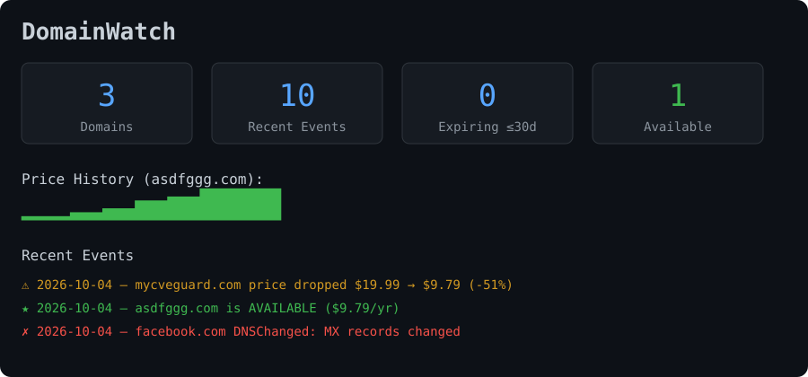

# DomainWatch

[](https://github.com/aavash-devkota/DomainWatch/actions/workflows/tests.yml)
[](https://github.com/aavash-devkota/DomainWatch/actions/workflows/docs.yml)
[](LICENSE)

**Domain availability, price, expiration, DNS and security monitoring from one CLI.**



Think *UptimeRobot for domains*: DomainWatch continuously watches domain names,
tracks registration prices over time, monitors expiration dates, audits DNS/email
security posture, and fires alerts to your favorite channel.

- Availability + price (registration / renewal) via GoDaddy `gddy`, with RDAP fallback
- Expiration monitoring (registered → expiring → expired → pending delete → available)
- Price history in SQLite (lowest / highest / current / average)
- RDAP registrar, status, nameservers
- DNS intelligence: A, AAAA, MX, NS, CNAME, TXT, CAA, SOA, DNSSEC
- Security audit: SPF, DMARC, CAA, MX, TLS scoring
- Alerts: console, webhook, Discord, ntfy, Telegram
- Adaptive scheduler with exponential backoff + jitter
- Multi-registrar price comparison (Porkbun / Cloudflare / Namecheap / GoDaddy / Dynadot)
- Domain Opportunity Scoring (`score`)
- CT monitoring + subdomain discovery
- Web dashboard with interactive terminal, Prometheus `/metrics`
- YAML config, `.env` secrets, plugin SDK

---

## Table of contents

0. [Operation flow & user guide](FLOW.md)
1. [Installation](#installation)
2. [Quick start](#quick-start)
3. [CLI reference](#cli-reference)
4. [Configuration](#configuration)
5. [Architecture](#architecture)
6. [Use cases](#use-cases)
7. [Deployment](#deployment)
8. [Development](#development)
9. [Roadmap](#roadmap)
10. [Contributing](#contributing)
11. [License](#license)

---

## Installation

### Requirements

| Requirement | Version | Notes |
|---|---|---|
| Python | ≥ 3.10 | |
| `gddy` CLI | latest | optional, enables GoDaddy pricing |
| GoDaddy account | — | optional, for pricing via `gddy` |
| Docker | any recent | optional, for container deploys |

### From source (recommended)

```bash
git clone https://github.com/aavash-devkota/DomainWatch.git
cd DomainWatch
pip install -e .
domain-monitor --help
```

For development (pytest, ruff, mypy):

```bash
pip install -e ".[dev]"
```

### GoDaddy CLI (optional, for live pricing)

```bash
curl -fsSL https://github.com/godaddy/cli/releases/latest/download/install.sh | bash
export PATH="$HOME/.local/bin:$PATH"
gddy auth login        # opens browser, one-time
```

Without `gddy`, every command except live GoDaddy pricing still works — availability,
registrar, expiration, nameservers come from RDAP.

### Verify

```bash
domain-monitor --version
domain-monitor rdap example.com
domain-monitor audit example.com
```

---

## Quick start

```bash
# Track a domain with a target price ceiling
domain-monitor add example.com -t 20

# One-off availability + price check
domain-monitor check example.com

# Continuous monitoring every 5 minutes
domain-monitor monitor example.com -i 300

# Inspect history, prices, expiry
domain-monitor history example.com
domain-monitor price example.com
domain-monitor expiration example.com
```

---

## CLI reference

| Command | Description |
|---|---|
| `domain-monitor check <d…> [--file domains.txt] [-t TARGET]` | One-off availability/price check |
| `domain-monitor add <d…> [-t TARGET]` | Track domains with optional target price |
| `domain-monitor remove <d…>` | Stop tracking |
| `domain-monitor list` | List tracked domains |
| `domain-monitor status` | Latest state of all tracked domains |
| `domain-monitor monitor <d…> [-i SECONDS]` | Add (if new) and start the monitor loop |
| `domain-monitor run [-c config.yaml] [-i SECONDS]` | Monitor using config file + tracked domains |
| `domain-monitor history <domain>` | All recorded checks |
| `domain-monitor price <domain>` | Lowest / highest / current / average price |
| `domain-monitor expiration <domain>` | Expiration date |
| `domain-monitor timeline [domain]` | Event timeline (availability, drops, expiry…) |
| `domain-monitor rdap <domain>` | Registrar, created/updated/expires, status, NS |
| `domain-monitor dns <domain>` | A/AAAA/MX/NS/CNAME/TXT/CAA/SOA |
| `domain-monitor audit <domain>` | DNSSEC/SPF/DMARC/CAA/MX/TLS security score |
| `domain-monitor discover <name> [--tlds …] [--prefixes …] [--suffixes …] [--workers N] [--only-available]` | Generate and rank candidate names |
| `domain-monitor score <domain>` | Domain Opportunity Score with transparent breakdown |
| `domain-monitor price-compare <domain>` | Compare register/renew/transfer across registrars |
| `domain-monitor watch [d…] [-i SECONDS]` | Live sweep view of tracked domains |
| `domain-monitor ct <domain> [--track]` | Certificate Transparency log entries |
| `domain-monitor subdomains <domain> [--resolve]` | Subdomain discovery |
| `domain-monitor tls <domain>` | TLS certificate details |
| `domain-monitor http <domain>` | HTTP status + security headers |
| `domain-monitor lifecycle <domain>` | Registered/expiring/expired/pending delete/available |
| `domain-monitor report` | Weekly-style report (availability, prices, expiring, events) |
| `domain-monitor doctor` | Diagnostics |
| `domain-monitor providers` | Provider health/latency probe |
| `domain-monitor db migrate\\|status\\|backup` | Schema version, migrations, backups |
| `domain-monitor keys create\\|list\\|revoke` | API key management |
| `domain-monitor export\\|import` | JSON/CSV/YAML portfolio export |
| `domain-monitor backup` | SQLite backup copy |
| `domain-monitor serve [--host] [--port]` | Web UI + REST API + metrics |

Global flags: `--version`, `-c/--config PATH` (before the subcommand).

## Web UI

```bash
domain-monitor serve
# open http://localhost:8080/dashboard
```

Tabs: Dashboard (stat cards, price chart, events), Domains, Events, Tools (multi-select probes),
Providers, Alerts & Keys, Settings (interval + notifications), Terminal (xterm.js + WebSocket PTY).
REST docs at `/docs`, Prometheus metrics at `/metrics`.

Example output — `domain-monitor audit facebook.com`:

```
Domain Security Audit: facebook.com
Score: 80/100

DNSSEC         ✗  
SPF            ✓  v=spf1 redirect=_spf.facebook.com
DMARC          ✓  v=DMARC1; p=reject; …
CAA            ✓  0 issue "digicert.com; …"
MX             ✓  10 smtpin.vvv.facebook.com.
HTTPS/TLS      ✓  DigiCert Inc
```

Example output — `domain-monitor price-compare cveguard.com`:

```
Registrar        Register      Renew   Transfer  Avail      Src
Porkbun             $9.73     $11.15      $9.73     no  catalog
Cloudflare          $9.77      $9.77      $9.77     no  catalog
Namecheap          $13.98     $15.98     $13.98     no  catalog
GoDaddy            $11.99     $19.99     $11.99     no  catalog
Dynadot             $9.49     $10.49      $9.49     no  catalog
```

Example output — `domain-monitor doctor`:

```
✓ Python 3.14
✓ Configuration
✓ SQLite database (~/.domainwatch/domainwatch.db)
✓ DNS resolver
✓ RDAP connectivity
✓ GoDaddy CLI
✗ GoDaddy auth (expired)
```

---

## Configuration

Config file location: `~/.domainwatch/config.yaml` (override with `-c`).
See `examples/config.yaml`.

```yaml
monitor:
  interval: 300          # seconds between full sweeps

domains:
  - domain: example.com
    target_price: 15
  - domain: example.dev
    target_price: 20

notifications:
  ntfy:
    enabled: true
    topic: https://ntfy.sh/my-secret-topic
  discord:
    enabled: true
    webhook: ${DISCORD_WEBHOOK}       # expanded from the environment
  telegram:
    enabled: true
    token: ${TELEGRAM_BOT_TOKEN}
    chat_id: ${TELEGRAM_CHAT_ID}
  webhook:
    enabled: false
    url: ${WEBHOOK_URL}
```

**Secrets never go in YAML.** Put them in `~/.domainwatch/.env` (see
`examples/.env.example`) or export them in your shell:

```bash
export TELEGRAM_BOT_TOKEN=…
export DISCORD_WEBHOOK=…
```

Data database: `~/.domainwatch/domainwatch.db` (SQLite).
Event log: `~/.domain_monitor.log` (legacy script).

---

## Architecture

```
                 ┌───────────────┐
                 │      CLI      │  domain-monitor check/run/audit/…
                 └───────┬───────┘
                         │
                 ┌───────▼───────┐
                 │  Core Engine  │  diff state vs history → events
                 └───────┬───────┘
                         │
        ┌────────────────┼─────────────────┐
        │                │                 │
  ┌─────▼─────┐    ┌─────▼─────┐    ┌──────▼─────┐
  │ Providers │    │   RDAP    │    │  DNS/audit │
  │ GoDaddy   │    │  client   │    │   engine   │
  │ RDAP fbk  │    └───────────┘    └────────────┘
  └───────────┘
        │
        ▼
 ┌──────────────┐     ┌────────────────┐
 │ Event Engine │────►│ Notifications  │  console / webhook / Discord / ntfy / Telegram
 └──────┬───────┘     └────────────────┘
        │
        ▼
 ┌──────────────┐
 │    SQLite    │  domains, checks, events, dns
 └──────────────┘
```

Package layout:

```
domainwatch/
├── cli/           argparse CLI (domain-monitor entry point)
├── core/          models, Engine (monitoring + diff + events)
├── events/        EventBus (pub/sub)
├── providers/     base Provider, GoDaddy (gddy), RDAP fallback
├── rdap/          RDAP client + parsing
├── dns/           record lookups, SPF/DMARC/CAA/DNSSEC
├── security/      audit scoring
├── notifications/ console, webhook, Discord, ntfy, Telegram
├── scheduler/     adaptive backoff interval
└── storage/       SQLite DB layer
```

Adding a provider = implement `check(domain) -> DomainState` in
`providers/base.py`'s interface and register it — the engine doesn't change.

---

## Use cases

- **Domain investor / buyer**: get alerted when a name drops below your target, or hits
  pending-delete and becomes registrable.
- **Security / Blue team**: `audit` reports missing DMARC/SPF/CAA/DNSSEC on customer domains.
- **Ops / SRE**: watch expiration across your portfolio so nothing lapses.
- **Brand protection**: track lookalike permutations from `discover` weekly.
- **Passive recon / CTI**: RDAP + DNS timelines for investigations.

---

## Deployment

### Bare metal / VM

```bash
pip install -e .
# run under systemd
sudo tee /etc/systemd/system/domainwatch.service <<'EOF'
[Unit]
Description=DomainWatch monitor
After=network-online.target

[Service]
Type=simple
User=kali
WorkingDirectory=/home/kali/Documents/domainwatch
EnvironmentFile=%h/.domainwatch/.env
ExecStart=/usr/local/bin/domain-monitor -c %h/.domainwatch/config.yaml run
Restart=on-failure

[Install]
WantedBy=multi-user.target
EOF
sudo systemctl enable --now domainwatch
```

### Docker

```bash
docker build -t domainwatch .
docker run -p 8080:8080 -v ./data:/root/.domainwatch domainwatch serve --host 0.0.0.0
# or
docker compose up -d
```

Prebuilt images (on tag push): `ghcr.io/aavash-devkota/domainwatch:latest`.

### Cron-style (single checks)

```cron
*/15 * * * * /usr/local/bin/domain-monitor -c ~/.domainwatch/config.yaml run >> ~/domainwatch.log 2>&1
```

---

## Development

```bash
pip install -e ".[dev]"
pytest -q
ruff check .
mypy domainwatch
```

Release process:

```bash
git tag -a vX.Y.Z -m "vX.Y.Z"
git push --tags
```

---

## Roadmap

Completed in v1.x: CT monitoring, subdomain discovery, multi-provider price comparison,
FastAPI + Prometheus + web dashboard, API keys + roles, Docker, CI/CD, docs site, plugin SDK.

Future: SMTP notifications, DKIM probing, Helm chart, PyPI release.

---

## Contributing

Contributions are welcome!

1. Fork → branch (`feat/…`, `fix/…`)
2. Add tests for new behavior; keep `pytest` + `ruff` green
3. One logical change per PR; describe *why*, not just *what*
4. New providers/notifiers: implement the matching base class and document config keys
5. Update `CHANGELOG.md` and this README

Please read [docs/contributing.md](docs/contributing.md) before contributing.

## License

MIT — see [LICENSE](LICENSE).
